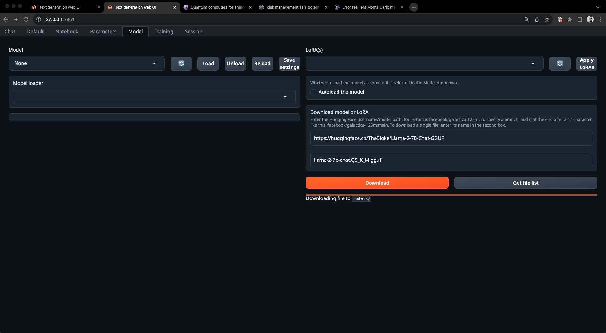
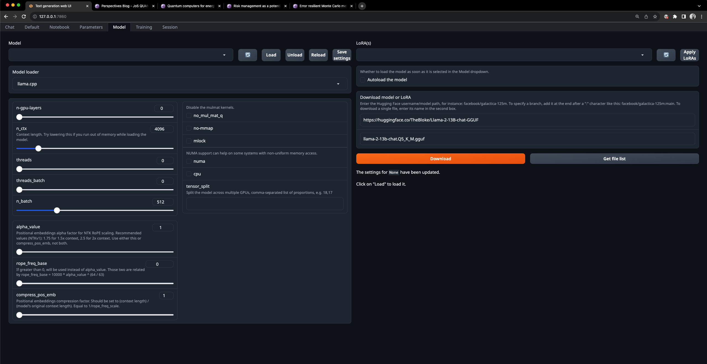
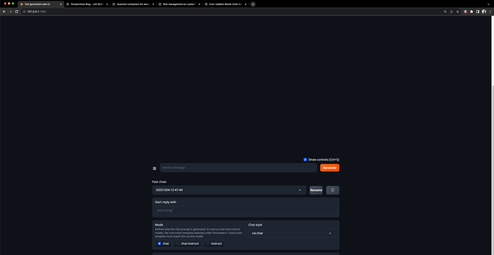

### The below setup is to run LLMs from the command line.

1. First, verify if you are pushing to BDR. If you do, then you need to remove from the `~/.gitconfig`

```bash
[user]
    name = henrikh.baghramyan
    email = henrikh.baghramyan@jos-quantum.de
[http]
    sslCert = mycert.key
```    

the lines 

```bash
[http]
    sslCert = mycert.key
```

but keep the original version saved somewhere.  

2. Next step would be to install a loader. This step I did only for macOS at the moment. I took instructions from 
[here](https://llama-cpp-python.readthedocs.io/en/latest/install/macos/)

First make sure you have `xcode` installed. I had it already, so I didn't follow the steps given below (I am not sure if they work):

```bash
# check the path of your xcode install 
xcode-select -p

# xcode installed returns
# /Applications/Xcode-beta.app/Contents/Developer

# if xcode is missing then install it... it takes ages;
xcode-select --install
```  

3. Install the conda version for macOS that supports Metal GPU:

```bash
wget https://github.com/conda-forge/miniforge/releases/latest/download/Miniforge3-MacOSX-arm64.sh
bash Miniforge3-MacOSX-arm64.sh  
```

Also, make sure you aren't using don't have any other version of Python or your system. At least try to remove those not required by the OS. You can follow these steps. This is important because even if you try to install dependencies with `pip` in an activated environment it might not install them in the environment itself which happened to me. Before running `pip` install make sure you are using the `pip` of the environment and not the system's. You can run `which pip` to check it.  


```bash
brew uninstall python
```  

Remove the Python Application:

Go to the `/Applications` directory.
Drag the Python application to the Trash.

Python installations may leave behind some files and directories. These can include scripts, caches, and other files in directories like `/Library/Python/` or `~/Library/Python/`. You can manually check these directories and remove any Python-related files if necessary. This command is useful if you wish to move the files and folders to the Trash and not to permanently delete them with `rm`.  
`osascript -e 'tell app "Finder" to move POSIX file "/usr/bin/python3" to trash'`

4. Install the webui to run the app on a browser

```bash
git clone https://github.com/oobabooga/text-generation-webui.git
cd text-generation-webui/

conda create -n textgen python=3.10.9 -y
activate textgen

pip install -r requirements_nowheels.txt
pip install torch torchvision torchaudio
```

5. Install the LATEST `llama-cpp-python`  


```bash
pip uninstall llama-cpp-python -y
CMAKE_ARGS="-DLLAMA_METAL=on" pip install -U llama-cpp-python --no-cache-dir
```

6. And finally either on the terminal or vscode run 
`python server.py`  
This assumes you are in `text-generation-webui` and have `textgen` activated and open the local URL:  `http://127.0.0.1:7860` which gives you this screen:  



Put in the download section the following URL:

`https://huggingface.co/TheBloke/Llama-2-7B-Chat-GGUF`

and the name of the model

`llama-2-7b-chat.Q5_K_M.gguf` and hit `Download`.

Once done, select `llama.cpp` a model loader select (if that's not selected automatically), `n-gpu-layers = 64` and `n_ctx = 1536` and load the model. You can try to increase `n-gpu-layers = 64` and decrease `n_ctx = 1536` if you have memory issues. My MacBook has 16Gb RAM and Apple M2 Pro. In the Parameters tab also adjust the value for `max_new_tokens` which defines how long the response would be. Typically, `800` should work for most of the tasks.  
You would see the following notice - `It seems to be an instruction-following model with template "Llama-v2". In the chat tab, instruct or chat-instruct modes should be used.` `Llama-v2` is a prompt template that has to be used otherwise the model doesn't really work. Prompt templates for LLMs are structured formats or frameworks used to guide the model in generating specific types of responses. They are used during both training and inference stages.  
Next, go to the `Chat` tab and down there at the bottom select either `instruct` or `chat-instruct`.   Then go ahead and ask questions. 
The other model you can use is here `https://huggingface.co/TheBloke/Llama-2-13B-chat-GGUF` and the version I suggest is `llama-2-13b-chat.Q5_K_M.gguf`. With the given above parameters it should work as well. 

My suggestion is not to trust much coding question answers but rather get the idea from them. This refers to all open access models. 

## Below are the instructions for the installation on Linux server with NVIDIA GPUs and usage. The best models have to be run using GPUs, unfortunately. Running them on CPUs is very slow. 

### Installation

0. You need to install first the CUDA driver following this [link](https://docs.nvidia.com/cuda/cuda-installation-guide-linux/index.html).

1. Install Miniforge if you haven't done it previously. It is more frequently updated that 
Miniconda nowadays.  

* Check for the architecture (most of the time it is x86_64). Run  

```bash
uname -a
```

for it. If you see `x86_64` than your CPU architecture is `x86_64` :) 

Next install it. 

```bash
wget https://github.com/conda-forge/miniforge/releases/latest/download/Miniforge-pypy3-Linux-x86_64.sh
bash Miniforge-pypy3-Linux-x86_64.sh
```

Follow this [link](https://github.com/conda-forge/miniforge) for more detailed instructions.

2. 

```bash
conda create -n textgen python=3.11
conda activate textgen
```

Before proceeding double check if you're using python and pip of the activated `textgen` environment. Run `which python` and `which pip` to check it.

3. 

Install Pytorch in an activated environment. 

```bash
pip3 install torch torchvision torchaudio --index-url https://download.pytorch.org/whl/cu121
```

and the CUDA runtime libraries:

```bash
conda install -y -c "nvidia/label/cuda-12.1.0" cuda-runtime
```

4. Install the web UI

```bash
git clone https://github.com/oobabooga/text-generation-webui
cd text-generation-webui
```

Check if your CPU supports the AVX2 instruction by running:

```bash
lscpu | grep -i avx2
```

If the output includes `avx2` somewhere that you have the support and run:

```bash
pip install -r requirements.txt
```

Otherwise, run:

```bash
pip install -r requirements_noavx2.txt
```

### Usage

In case you already have everything installed.

1. Set up an ssh connection configuration like so:  

```bash
Host gpuserver
    HostName 51.68.167.118
    User ubuntu
    IdentityFile ~/.ssh/your_private_key
    Port 22
```

2. In the Terminal, connect to the server using port forwarding like this:

```bash
ssh -L 7860:127.0.0.1:7860 gpuserver
```

so that you can use it locally at `http://127.0.0.1:7860/`

You would need to modify `7860` port if it is busy locally and on the server. 

3. 

```bash
cd projects/text-generation-webui/
conda activate textgen
python server.py
```


3. Open `http://127.0.0.1:7860/` open on your desired browser. Next, go to repo `https://huggingface.co/TheBloke/Llama-2-13B-chat-GGUF` and download this model `llama-2-13b-chat.Q5_K_M.gguf`. This model is suggested because it is one of the most downloaded models and is supported by `https://github.com/abetlen/llama-cpp-python` model loader. The latter works on macOS too. To download the model you can use the webui you're running on the browser. Copy the link to the repo and the model version like so:



and press `Download`. After that, press the refresh button and the downloaded model should appear on the list of available models to load. It automatically, selects `llama.cpp` as a model loader. Keep it that way. Before loading the model adjust the number of value for `n-gpu-layers`. Bigger values for this means more of GPU is going to be used `64` should work fine but you can opt for higher numbers as well (up to `128`). Also, adjust the number for `n_ctx` which defines how long the prompt would be. This depends on the tasks given to the chat. Normally, `8000` should be fine for most of the tasks. In the Parameters tab also adjust the value for `max_new_tokens` which defines how long the response would be. Typically, `800` should work for most of the tasks. You can save the model loading settings by pressing `Save settings` button. You can keep other parameters unchanged, and please refer to them in `README.md`. Then load the model which takes few seconds. You would see the following notice - `It seems to be an instruction-following model with template "Llama-v2". In the chat tab, instruct or chat-instruct modes should be used.` `Llama-v2` is a prompt template that has to be used otherwise the model doesn't really work. Prompt templates for LLMs are structured formats or frameworks used to guide the model in generating specific types of responses. They are used during both training and inference stages.  
Next, go to the `Chat` tab and down there at the bottom select either `instruct` or `chat-instruct`. 



I suggest using `instruct` prompts which are designed for more straightforward, instruction-based interactions. They are good for queries where you need direct, concise, and instructional responses. `chat-instruct` are tailored for a more conversational style, maintaining an instructional focus. Then go ahead and ask you question :) You can try this one:

`Please write a calculator function in python.` 

You can download the following models as well.  
Repo - https://huggingface.co/TheBloke/CodeLlama-34B-Instruct-GGUF  
Model - codellama-34b-instruct.Q5_K_M.gguf  
This one is particularly good for coding.

Repo - https://huggingface.co/TheBloke/Llama-2-7B-Chat-GGUF  
Model - llama-2-7b-chat.Q5_K_M.gguf  