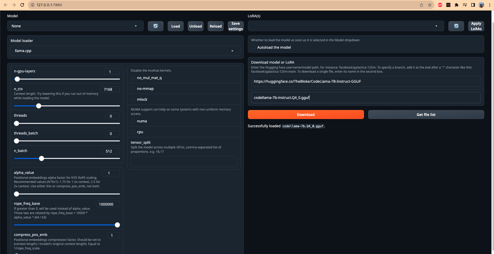

### It is highly recommended checking the official webpage 

### The below setup is to run LLMs from the command line.

First, verify if you are pushing to BDR. If you do, then you need to remove from the `~/.gitconfig`

```bash
[user]
    name = henrikh.baghramyan
    email = henrikh.baghramyan@jos-quantum.de
[http]
    sslCert = mycert.key
```    

the lines 

```bash
[http]
    sslCert = mycert.key
```

but keep the original version saved somewhere. Next step would be to install a loader. This step I did only for macOS at the moment. The instructions are 
[here](https://llama-cpp-python.readthedocs.io/en/latest/install/macos/)

* Then, for macOS users, first make sure you have `xcode` installed. I had it already, so I didn't follow the steps given below (I am not sure if they work):

```bash
# check the path of your xcode install 
xcode-select -p

# xcode installed returns
# /Applications/Xcode-beta.app/Contents/Developer

# if xcode is missing then install it... it takes ages;
xcode-select --install
```  

* Install the conda version for MacOS that supports Metal GPU:

```bash
wget https://github.com/conda-forge/miniforge/releases/latest/download/Miniforge3-MacOSX-arm64.sh
bash Miniforge3-MacOSX-arm64.sh  
```

Also, make sure you don't have any other version of Python or your system. At least try to remove those not required by the OS. You can follow these steps. This is important because even if you install dependencies with `pip` in an activated environment it might not install them in it which happened to me. Before running `pip` install make sure you are using the `pip` of the environment and not the system's. You can run `which pip` to check it.  

1. 
```bash
brew uninstall python
```  

2. 
Remove the Python Application:

Go to the `/Applications` directory.
Drag the Python application to the Trash.

3. 
Python installations may leave behind some files and directories. These can include scripts, caches, and other files in directories like `/Library/Python/` or `~/Library/Python/`. You can manually check these directories and remove any Python-related files if necessary. This command is useful if you wish to move the files and folders to the Trash and not to permanently delete them with `rm`.  
`osascript -e 'tell app "Finder" to move POSIX file "/usr/bin/python3" to trash'`

* Install the webui to run the app on a browser

```bash
git clone https://github.com/oobabooga/text-generation-webui.git
cd text-generation-webui/

conda create -n textgen python=3.10.9 -y
activate textgen

pip install -r requirements_nowheels.txt
pip install torch torchvision torchaudio
```

* Install the LATEST `llama-cpp-python`  


```bash
pip uninstall llama-cpp-python -y
CMAKE_ARGS="-DLLAMA_METAL=on" pip install -U llama-cpp-python --no-cache-dir
```

* run
`python server.py`

and open the local URL:  `http://127.0.0.1:7860` which gives you this screen:  


Put in the download section the following URL:

`https://huggingface.co/TheBloke/CodeLlama-7B-Instruct-GGUF`

and the name of the model

`codellama-7b-instruct.Q4_0.gguf`.

as a model loader select `llama.cpp`, `n-gpu-layers = 1` and `n_ctx = 7168` (this one depends on you system) and load the model, go to chat and ask a question like so:

`can you generate an example of function in python?`. It should work :)

For bigger models like this https://huggingface.co/TheBloke/CodeLlama-13B-Instruct-GGUF, I think I have a memory issue.

## Below are the instructions for the installation on Linux server with NVIDIA GPUs and usage. The best models have to be run using GPUs, unfortunately. Running them on CPUs is very slow. 

### Installation

0. You need to install first the CUDA driver following this [link](https://docs.nvidia.com/cuda/cuda-installation-guide-linux/index.html).

1. Install Miniforge if you haven't done it previously. It is more frequently updated that 
Miniconda nowadays.  

* Check for the architecture (most of the time it is x86_64). Run  

```bash
uname -a
```

for it. If you see `x86_64` than your CPU architecture is `x86_64` :) 

Next install it. 

```bash
wget https://github.com/conda-forge/miniforge/releases/latest/download/Miniforge-pypy3-Linux-x86_64.sh
bash Miniforge-pypy3-Linux-x86_64.sh
```

Follow this [link](https://github.com/conda-forge/miniforge) for more detailed instructions.

2. 

```bash
conda create -n textgen python=3.11
conda activate textgen
```

Before proceeding double check if you're using python and pip of the activated `textgen` environment. Run `which python` and `which pip` to check it.

3. 

Install Pytorch in an activated environment. 

```bash
pip3 install torch torchvision torchaudio --index-url https://download.pytorch.org/whl/cu121
```

and the CUDA runtime libraries:

```bash
conda install -y -c "nvidia/label/cuda-12.1.0" cuda-runtime
```

4. Install the web UI

```bash
git clone https://github.com/oobabooga/text-generation-webui
cd text-generation-webui
```

Check if your CPU supports the AVX2 instruction by running:

```bash
lscpu | grep -i avx2
```

If the output includes `avx2` somewhere that you have the support and run:

```bash
pip install -r requirements.txt
```

Otherwise, run:

```bash
pip install -r requirements_noavx2.txt
```

### Usage

In case you already have everything installed.

1. Setup an ssh connection configuration like so:  

```bash
Host gpuserver
    HostName 51.68.167.118
    User ubuntu
    IdentityFile ~/.ssh/your_private_key
    Port 22
```

2. In the Terminal, connect to the server using port forwarding like this:

```bash
ssh -L 7861:127.0.0.1:7860 gpuserver
```

so that you can use it locally at `http://127.0.0.1:7860/`

You would need to modify `7860` port if it is busy locally and on the server.

After that 


